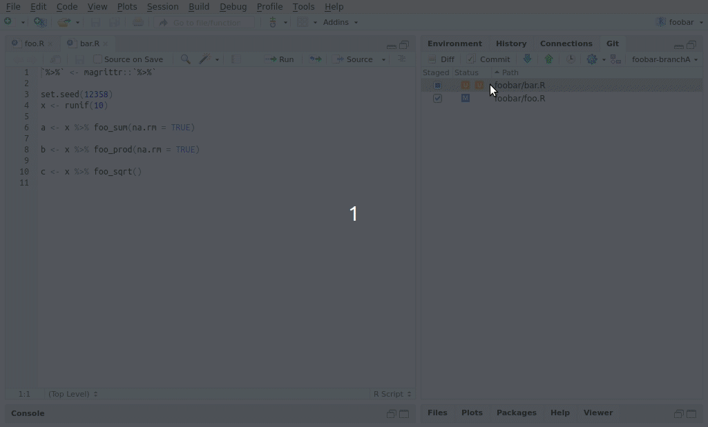

<!-- README.md is generated from README.Rmd. Please edit that file -->

```{r setup, include = FALSE}
knitr::opts_chunk$set(
  collapse = TRUE,
  comment = "#>",
  fig.path = "man/figures/README-",
  out.width = "100%"
)
```


# compareWith: RStudio Addins for Enhanced Diff and Merge

<!-- badges: start -->
[](https://github.com/miraisolutions/compareWith/actions)
<!-- badges: end -->
  
**compareWith** is an R package providing user-friendly [RStudio addins](https://rstudio.github.io/rstudioaddins/) that make it easier to perform **diff** and **merge** tasks, compared to the limited functionality offered by RStudio itself, especially with projects under version control.

Tasks **compareWith** greatly helps with include:

- Compare differences prior to commit, for individual files or the whole project.
- Inspect and resolve merge conflicts via three-way comparison.
- Compare two distinct files with each other.

The package relies on [**Meld**](http://meldmerge.org/), a common visual diff and merge tool.


## Installation

You can install the latest **compareWith** from GitHub using the [**remotes**](https://CRAN.R-project.org/package=remotes) package
```{r github-install, eval = FALSE}
remotes::install_github("miraisolutions/compareWith")
```

The required dependency [Meld](http://meldmerge.org) is available for most Linux/Unix distributions and can be easily installed there, e.g. via `sudo apt-get install meld` on **Debian/Ubuntu**.

On **Windows**, its installation is supported by an MSI installer, downloadable from the Meld website. We recommend using the **3.18.3** installer (as hinted on the website), since newer versions seem to have Gtk issues. After installation, you may have to add the location of the installed `meld.exe` to the `PATH` environment variable.

Meld is not yet officially supported on **MacOS**. However, pre-built binaries [are available](https://github.com/yousseb/meld/releases) as `meldmerge.dmg` images for new and old releases of Meld. We currently recommend using Meld **3.16.0**, as newer versions do not appear to be stable. After installation, you need to make sure `meld` can be launched from the command line, e.g. via:
```{bash, eval = FALSE}
ln -s /Applications/Meld.app/Contents/MacOS/Meld /usr/local/bin/meld
```
Meld can also be installed via MacPorts, Fink or Brew, where you may also have to switch to an older stable version.


## Usage

The functionality of **compareWith** is accessible in RStudio using the _Addins_ menu.

### Check current modifications


### Compare with other branch or commit

Addins:  

- "Compare commits or branches..." to compare two different commits or branches
- "Compare current with commit or branch..." to compare the current state with another commit or branch. 

Functions:

- `compare_commit()` to compare current modifications with last commit. Default to `compare_commit("HEAD", "")`
    + Similar to `compare_project_with_repo()`
- `compare_commit("master", "HEAD")` to compare last commit of your branch with last commit of _master_ branch
- `compare_commit("master", "")` to compare current modifications with last commit of _master_ branch
    - Same as `compare_branch()`
- `compare_commit("master", "dev")` to compare last commit of _dev_ branch with last commit of _master_ branch
- `compare_commit("4224815", "")` to compare current modifications (not commit) with commit `4224815`
