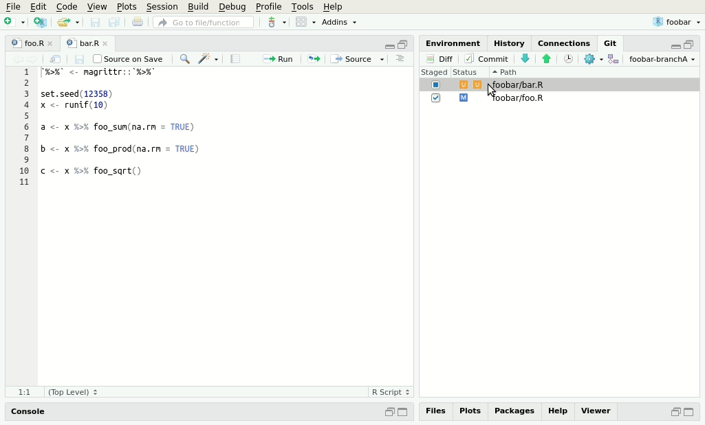

<!-- README.md is generated from README.Rmd. Please edit that file -->
compareWith: RStudio Diff / Merge Addins with VCS Capabilities
==============================================================

**compareWith** is an R package providing user-friendly [RStudio addins](https://rstudio.github.io/rstudioaddins/) to make **diff** and **merge** tasks easier due to the limited functionality offered by RStudio itself, especially with projects under version control.

Tasks **compareWith** greatly helps with include

-   compare differences prior to commit, for individual files or the whole project;
-   inspect and resolve merge conflicts via three-way comparison;
-   compare two distinct files with each other.

The functionality of **compareWith** relies on [**Meld**](http://meldmerge.org/), a common visual diff and merge tool.

Installation
------------

You can install the latest **compareWith** from GitHub using the [**remotes**](https://CRAN.R-project.org/package=remotes) package

``` r
remotes::install_github("miraisolutions/compareWith")
```

An installation of [Meld](http://meldmerge.org) is also required. Meld is available for most Linux/Unix distributions and can be easily installed, e.g. via `sudo apt-get install meld` on Debian/Ubuntu.

On Windows, the installation is supported by an MSI installer downloadable from the Meld website. After installation, you may have to add the location of the installed `meld.exe` to the `PATH` environment variable.

MacOS is not yet officially supported. It is suggested to use the pre-built binaries from the website; however, this installation does not allow to call `meld` from the command line. You can either update your `.bashrc` file or install `meld` via `homebrew`:

      brew tap homebrew/cask
      brew cask install meld

Usage
-----

compareWith functionalities are accessible in the *Addins* menu.


